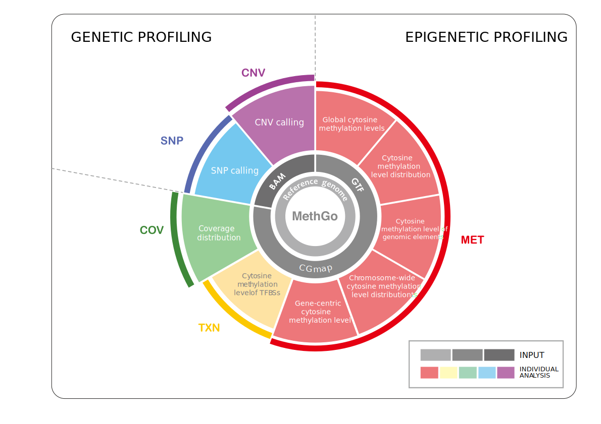

.. MethGo documentation master file, created by
   sphinx-quickstart on Sun Jul 19 01:34:12 2015.
   You can adapt this file completely to your liking, but it should at least
   contain the root `toctree` directive.

Welcome to MethGo's documentation!
==================================

DNA methylation is a major epigenetic modification regulating several biological
processes. A standard approach in the study of DNA methylation is bisulfite
sequencing (BS-Seq). BS-Seq couples bisulfite conversion of DNA with next
generation sequencing to provide a genome wide profile of DNA methylation at
single base resolution. The analysis of BS-Seq data involves the use of
customized aligners for mapping reads and additional bioinformatic pipelines for
downstream data analysis. While most post-alignment programs generate
methylation calls, MethGo carries out subsequent genomic and epigenomic analyses
to comprehensively explore BS-Seq datasets.

MethGo is a simple and effective tool designed for the analysis of data from
whole genome bisulfite sequencing (WGBS) and reduced representation bisulfite
sequencing (RRBS). MethGo provides 5 major modules:

* COV: Coverage distribution of each cytosine
* MET: Both global and gene-centric cytosince methylation levels
* TXN: Cytosine methylation levels at transcription factor binding sites (TFBSs)
* SNP: Single nucleotide polymorphism (SNP) calling
* CNV: Copy number variation calling

Contents:

.. toctree::
    :maxdepth: 2

    install
    guide

Indices and tables
==================

* :ref:`genindex`
* :ref:`modindex`
* :ref:`search`

